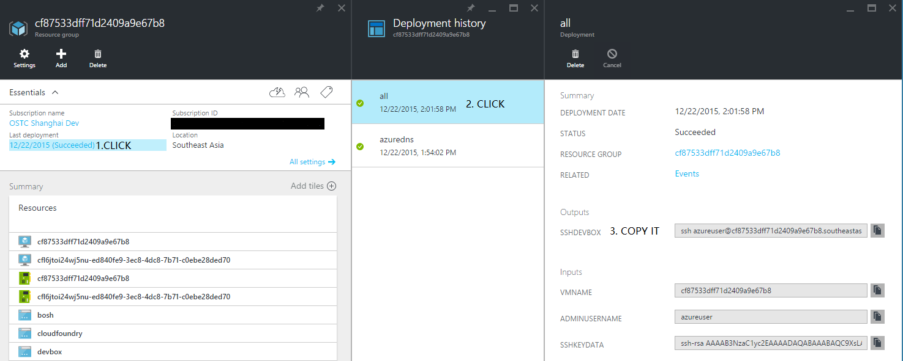

# Deploy BOSH on Azure via ARM templates

# 1 Prepare Azure Resources

Here we’ll create the following Azure resources that’s required for deploying BOSH and Cloud Foundry:

* A default Storage Account
* Three reserved public IPs
  * For dev-box
  * For Cloud Foundry
  * For Bosh
* A Virtual Network
* A Virtual Machine as your dev-box
* A Bosh director if you need

The [**bosh-setup**](https://github.com/Azure/azure-quickstart-templates/tree/master/bosh-setup) ARM template can help you to deploy all the above resources on Azure. Just click the button below with the following parameters:

<a href="https://portal.azure.com/#create/Microsoft.Template/uri/https%3A%2F%2Fraw.githubusercontent.com%2FAzure%2Fazure-quickstart-templates%2Fmaster%2Fbosh-setup%2Fazuredeploy.json" target="_blank">
    
</a>

| Name | Required | Default Value | Description |
|:----:|:--------:|:-------------:|:----------- |
| vmName | **YES** | | Name of Virtual Machine |
| adminUsername | **YES** | | Username for the Virtual Machines. **Never use root as the adminUsername**. |
| sshKeyData | **YES** | | SSH **RSA** public key file as a string. |
| environment | **YES**  | | Different environments in Azure. Choose AzureCloud for Global Azure, and choose AzureChinaCloud for Mooncake (Azure China Cloud). |
| tenantID | **YES**  | | ID of the tenant |
| clientID | **YES**  | | ID of the client |
| clientSecret | **YES** | | secret of the client |
| autoDeployBosh | NO | enabled | The flag allowing to deploy the Bosh director. |

>**NOTE:**
  * Currently BOSH can be only deployed from a Virtual Machine (dev-box) in the same virtual network on Azure.

## 1.1 Basic Configuration

### 1.1.1 Generate your Public/Private Key Pair

The parameter `sshKeyData` should be a string which starts with `ssh-rsa`.

* For Linux/Mac Users

  Use ssh-keygen to create a 2048-bit RSA public and private key files, and unless you have a specific location or specific names for the files, accept the default location and name.

  ```
  ssh-keygen -t rsa -b 2048
  ```

  Then you can find your public key in `~/.ssh/id_rsa.pub`, and your private key in `~/.ssh/id_rsa`. Copy and paste the contents of `~/.ssh/id_rsa.pub` as `sshKeyData`.

  Reference: [How to Use SSH with Linux and Mac on Azure](https://azure.microsoft.com/en-us/documentation/articles/virtual-machines-linux-use-ssh-key/)

* For Windows Users

  1. Use `PuttyGen` to generate a public and private key pair.
  2. Use the public key as `sshKeyData`.
  3. Save the private key as a .ppk file.
  4. When you login the dev-box, use the .ppk file as the private key file for authentication.

  Reference: [How to Use SSH with Windows on Azure](https://azure.microsoft.com/en-us/documentation/articles/virtual-machines-windows-use-ssh-key/)

### 1.1.2 Specify your Service Principal

The service principal includes `tenantID`, `clientID` and `clientSecret`. If you have an existing service principal, you can reuse it. If not, you should click [**HERE**](../create-service-principal.md) to learn how to create one.

### 1.1.3 Deploy Bosh Director Automatically

By default, `autoDeployBosh` is set to `enabled`. The Bosh director will be deployed by the template. As a result, the deployment time of `bosh-setup` template will be much longer (~1h).

If you would like to deploy Bosh using a more customized `bosh.yml`, you can set `autoDeployBosh` to `disabled`. After the deployment succeeds, you can login the dev-box, update `~/bosh.yml`, and run `./deploy_bosh.sh`.

## 1.2 Advanced Configurations

If you want to customize your `bosh-setup` template, you can modify the following variables in [azuredeploy.json](https://github.com/Azure/azure-quickstart-templates/blob/master/bosh-setup/azuredeploy.json).

| Name | Default Value |
|:----:|:-------------:|
| storageAccountType | Standard_RAGRS |
| virtualNetworkName | boshvnet-crp |
| virtualNetworkAddressSpace | 10.0.0.0/16 |
| subnetNameForBosh | Bosh |
| subnetAddressRangeForBosh | 10.0.0.0/24 |
| subnetNameForCloudFoundry | CloudFoundry |
| subnetAddressRangeForCloudFoundry | 10.0.16.0/20 |
| devboxNetworkSecurityGroup | nsg-devbox |
| boshNetworkSecurityGroup | nsg-bosh |
| cfNetworkSecurityGroup | nsg-cf |
| vmSize | Standard_D1 |
| devboxPrivateIPAddress | 10.0.0.100 |
| ubuntuOSVersion | 14.04.3-LTS |
| keepUnreachableVMs | false |

>**NOTE:**
  * The default type of Azue storage account is "Standard_RAGRS" (Read access geo-redundant storage). For a list of available Azure storage accounts, their capacities and prices, check [**HERE**](http://azure.microsoft.com/en-us/pricing/details/storage/). Please note Standard_ZRS account cannot be changed to another account type later, and the other account types cannot be changed to Standard_ZRS. The same goes for Premium_LRS accounts.
  * `vmSize` is the instance type of the dev-box. For a list of available instance types, please check [**HERE**](https://azure.microsoft.com/en-us/documentation/articles/virtual-machines-size-specs/).
  * Set `keepUnreachableVMs` as true when you want to keep unreachable VMs when the deployment fails.

# 2 Login your dev-box

After the deployment succeeded, you can find the resource group with the name you specified on Azure Portal. The VM in the resource group is your dev-box.

* For Linux/Mac Users

  You can find the output `SSHDEVBOX` in `Last deployment`. `SSHDEVBOX` is a string just like `ssh <adminUsername>@<vm-name-in-lower-case>.<location>.cloudapp.azure.com`.
  
  

  The private key is `~/.ssh/id_rsa` if you accept the default location and name when you generate the ssh key. If so, please run `ssh <adminUsername>@<vm-name-in-lower-case>.<location>.cloudapp.azure.com` to login your dev-box.

  If you specified the location and name of the private key, please run `ssh <adminUsername>@<vm-name-in-lower-case>.<location>.cloudapp.azure.com -i <path-to-your-private-key>`.

* For Windows Users

  1. Open **Putty**.
  1. Fill in `Public IP address/DNS name label` of the dev-box.
  2. Before selecting **Open**, click the `Connection > SSH > Auth` tab to choose your private key (.ppk).

After you login, you can check `~/install.log` to determine the status of the deployment. When the deployment succeeds, you will find **Finish** at the end of the log file and no **ERROR** message in it.

# 3 Deploy BOSH

If you have enabled the parameter `autoDeployBosh`, you can skip this step.

## 3.1 Configure

The ARM template pre-creates and configure the deployment manifest file `bosh.yml` in your home directory. You do not need to update it unless you have other specific configurations.

## 3.2 Deploy

Run the following commands in your home directory to deploy bosh:

```
./deploy_bosh.sh
```

>**NOTE:**
  * Never use root to perform these steps.
  * More verbose logs are written to `~/run.log`.
  * If you hit any issue, please see [**troubleshooting**](../../additional-information/troubleshooting.md), [**known issues**](../../additional-information/known-issues.md) and [**migration**](../../additional-information/migration.md). If it does not work, you can file an issue [**HERE**](https://github.com/cloudfoundry-incubator/bosh-azure-cpi-release/issues).
